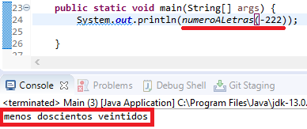
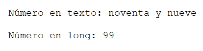

# Numero-A-Letras

## Numero A Letras con java (incluye numeros negativos,del 0 al 999.999)

## Letras A Numeros

~~~java

System.out.println(TextoLong.textoALong("menos doscientos veintidos"));

~~~

